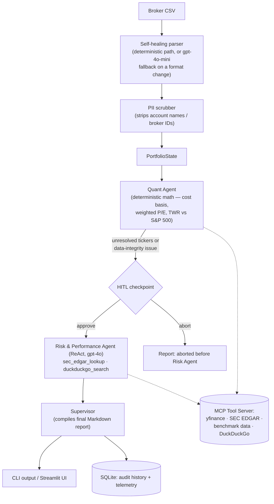

# Portfolio Value Agent

Turns a 4-hour manual portfolio audit — extracting trade histories, converting currencies, cross-checking valuation metrics against SEC filings — into a 30-second automated report, for any broker CSV.

**[Live demo →](https://portfolio-value-agent-tanyutnxtfkye9esfpeice.streamlit.app/)** — upload a DEGIRO transaction CSV and get a benchmarked valuation + AI risk audit back, no install required.

This is a portfolio project built to demonstrate agentic-AI product architecture for Senior PM roles: multi-agent orchestration, self-healing data pipelines, MCP tool integration, deterministic execution guardrails, and an Open-Core PLG go-to-market strategy — not a production trading tool.

## What it does

Retail value investors across DEGIRO, Interactive Brokers, and Schwab spend hours manually reconciling trade histories and computing valuation metrics by hand. This agent ingests a broker's raw CSV export and produces:

- Weighted P/E, cost basis, and net return, computed deterministically (never by an LLM)
- Time-weighted return vs. the S&P 500, with a rebased performance chart
- An AI-driven risk audit that investigates *why* a holding looks anomalous (low FCF yield, high leverage, negative P/E) by pulling recent SEC filings and news
- A performance-attribution writeup explaining over/underperformance vs. benchmark
- A human-in-the-loop checkpoint before any paid LLM call, whenever the data itself looks incomplete or inconsistent (unmapped tickers, an oversell)

## Architecture



Every external call (`yfinance`, SEC EDGAR, DuckDuckGo) goes through a retry-with-backoff wrapper and fires a telemetry event on failure — these are unofficial/free APIs known to rate-limit, and the pipeline is built to degrade gracefully rather than crash the whole audit when one data point is temporarily unavailable.

## Tech stack

| Layer | Choice |
|---|---|
| Agent orchestration | LangGraph (`StateGraph`); the ReAct risk agent uses `langchain.agents.create_agent` |
| Models | `gpt-4o-mini` for parsing/routing (>80% of calls), `gpt-4o` for qualitative synthesis |
| Tool layer | Model Context Protocol (MCP) server: `yfinance`, SEC EDGAR, DuckDuckGo, benchmark data |
| Data & persistence | `pandas`, `pydantic`, SQLAlchemy + SQLite |
| Web UI | Streamlit + Plotly |
| Testing | `pytest` for deterministic logic and tool-routing; LangSmith for tracing and qualitative eval |

## Getting started

```bash
git clone https://github.com/bleg/portfolio-value-agent.git
cd portfolio-value-agent
python -m venv .venv && source .venv/bin/activate
pip install -r requirements.txt
cp .env.example .env   # fill in OPENAI_API_KEY, SEC_EDGAR_USER_AGENT, etc.
```

### CLI

```bash
python src/main.py <csv_path> [output_path]   # default output: portfolio_audit.md
```

### Web UI

```bash
streamlit run src/app.py
```

Or just use the [live demo](https://portfolio-value-agent-tanyutnxtfkye9esfpeice.streamlit.app/) — no local setup needed.

## Observability

Every run — CLI or web — is traced end to end via LangSmith when `LANGCHAIN_TRACING_V2` is set (see `.env.example`): parse → quant → HITL → risk → report, with every LLM call and MCP tool call as a nested span.

## Product strategy: Open-Core PLG

- **BYOK tier (this repo):** open-sourced under MIT, free to fork and run with your own OpenAI key. Zero COGS, drives top-of-funnel acquisition via developer/value-investing communities.
- **Hosted SaaS (roadmap):** a frictionless €5/month web app for non-technical retail investors who don't want to manage API keys or a Python environment — see Phase 2 below.
- **Unit economics:** >80% of LLM calls route to `gpt-4o-mini` (parsing, routing, schema validation); `gpt-4o` is reserved for qualitative risk/performance synthesis. This keeps COGS to fractions of a cent per audit on the BYOK tier and preserves margin on the hosted tier.

## Roadmap

- **Phase 1 (current):** open-source CLI + Streamlit demo, local SQLite, BYOK.
- **Phase 2:** FastAPI REST API, Supabase/PostgreSQL with row-level security for multi-tenant auth, Stripe-gated SaaS tier.

Full epic-by-epic build history is in [`epics_roadmap.md`](epics_roadmap.md); the full architecture/product brief is in [`claude.md`](claude.md).

## Repository structure

```text
portfolio-value-agent/
├── src/
│   ├── main.py              # CLI entry point (parse -> quant -> HITL -> risk -> report)
│   ├── app.py                # Streamlit web UI
│   ├── state.py               # LangGraph state (Pydantic models)
│   ├── db_controller.py       # Deterministic DB writes, scoped reads
│   ├── mcp_server.py          # MCP tool server (yfinance, SEC EDGAR, DuckDuckGo, benchmarks)
│   ├── resilience.py          # Retry-with-backoff + timeout for MCP tool calls
│   ├── telemetry.py           # Product analytics event logging
│   ├── parsers/                # Self-healing CSV ingestion + FX + PII scrubbing
│   └── agents/                 # Quant Agent, Risk Agent, Supervisor
├── tests/                    # pytest suite
└── epics_roadmap.md           # Dependency-ordered build log (8 epics)
```

## License

MIT — see [LICENSE](LICENSE).
